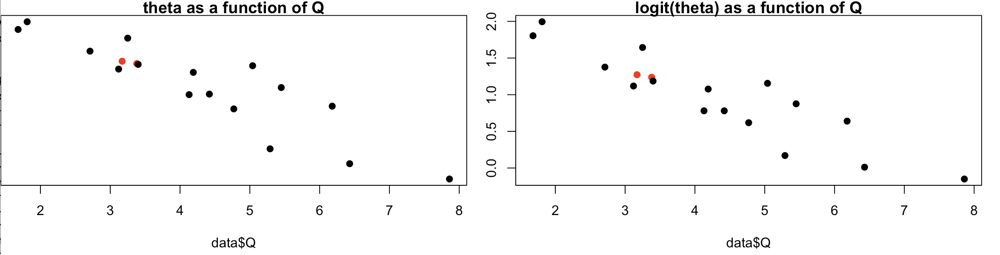
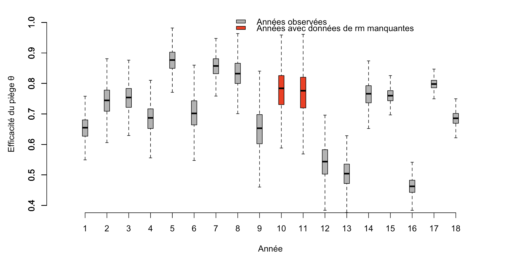
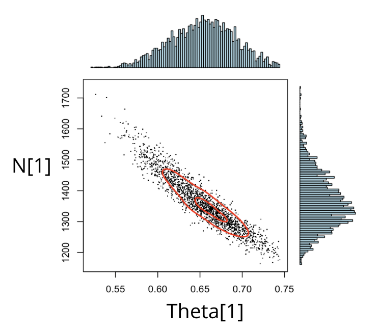
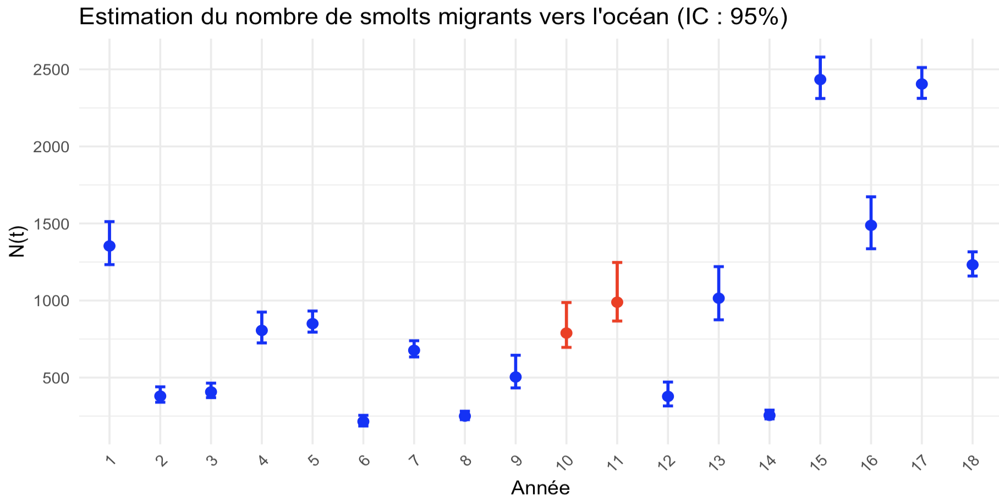
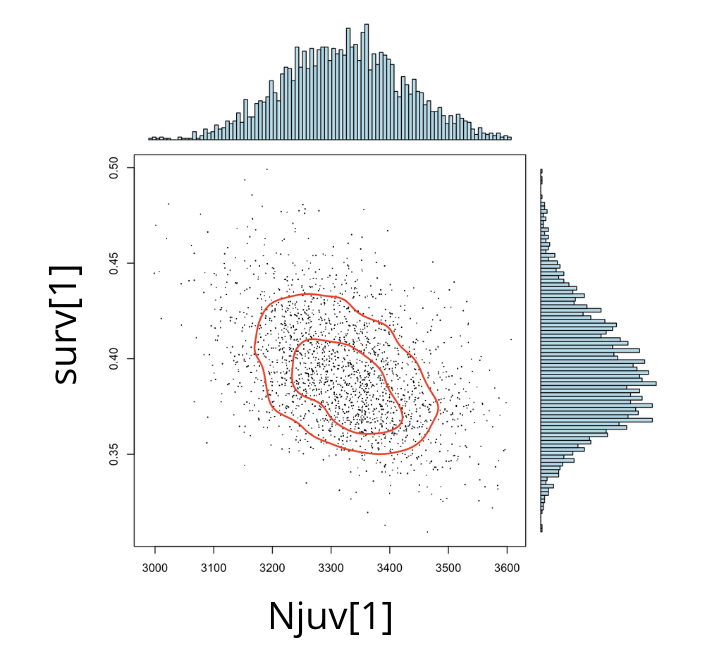
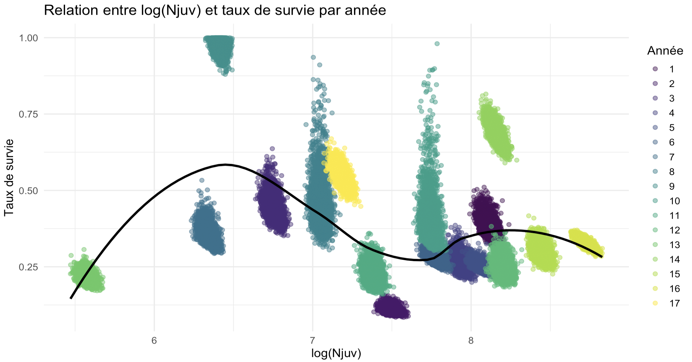
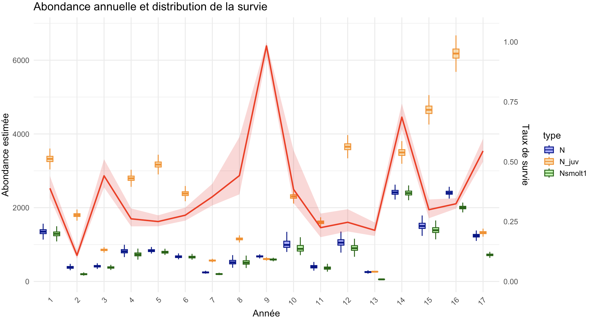

```{r setup, include=FALSE}
knitr::opts_chunk$set(
  echo = TRUE,
  message = FALSE,
  warning = FALSE,
  fig.align = 'center',
  fig.width = 8,
  fig.height = 5
)

# Chargement des bibliothèques
library(rjags)
library(coda)
library(ggplot2)
library(knitr)
```

\newpage
# Contexte de l’étude et dispositif expérimental
Dans ce rapport, nous présentons une analyse bayésienne dont le but est d’estimer le nombre de smolts de saumons atlantique (*Salmo salar*) qui migrent chaque année vers l'océan. En nous appuyant sur des données de capture-marquage-recapture collectées de 1986 à 2003, nous développons un modèle hiérarchique bayésien implémenté dans JAGS (Just Another Gibbs Sampler).

## Problématique et objectif
Le saumon atlantique présente un cycle de vie anadrome, caractérisé par une phase juvénile en eau douce suivie d'une migration vers la mer. Le passage du stade juvénile au stade smolt est une transformation physiologique appelée smoltification ou l'organisme aquiert sa tolérance à l’eau salée. Cela lui permet de migrer vers l’océan où s’effectue la majeure partie de la croissance avant que celui-ci retourne vers sa rivière d’origine pour sa reproduction.

L'objectif principal de cet étude est d'**estimer le nombre total de smolts qui migrent vers l'océan chaque année N(t)**.

## Données disponibles
Les données proviennent d’un programme de suivi des populations et nous utiliserons spécifiquement les données issues de la station de contrôle de Cerisel, un moulin situé sur l’Oir, un affluent de la Sélune. Ce site est équipé d’un dispositif de piégeage permettant de réaliser des opérations de capture-marquage-recapture (CMR) des smolts qui dévalent vers l’océan. Les données couvrent la période 1986-2003.

{ width=6cm }

Chaque année **t**, un nombre **N(t)** de smolts dévalent l'Oir. Une proportion $\theta(t)$ emprunte le bief d’amenée vers le piège et un nombre $c(t)$ de smolts sont capturés, ici $\theta(t)$ correspond donc à **l'efficacité du piège**.  Parmis les smolts capturés, $m(t)$ sont marquées à l’aide de tags et sont ensuite relâchés à environ 2 km en amont du piège. Enfin, un nombre $rm(t)$ d'entre eux sont recapturés lors de leur seconde dévalaison. Le débit de la rivière *Q(t)* est également enregistré comme covariable environnementale car cela à impact notable sur **l'efficacité du piège** $\theta(t)$.

## Avantages de l'approche bayésienne pour notre problématique

Dans le cadre de notre étude, l’utilisation d’un modèle bayésien intégré hiérarchique est particulièrement adaptée. En effet, les variables que nous cherchons à modéliser sont latentes (il n’est pas possible de compter directement l’ensemble des smolts). Nous exploitons donc les observations (c(t), m(t), rm(t) et Q(t)) pour inférer la dynamique des états cachés d’intérêts, à savoir $\theta(t)$ et in fine $N(t)$.

Les variables latentes s’insèrent dans plusieurs sous-modèles intégrés : le modèle CMR pour les captures et recaptures et le modèle d'effets aléatoires pour $\theta(t)$ avec le débit $Q(t)$ en covariable explicative. L’approche bayésienne intégrée permet une propagation naturelle de l’incertitude à travers les différentes distributions des paramètres latents.

Enfin, pour certaines années (1995 et 1996) les données de recaptures sont manquantes **rm(t)**. La dimension hiérarchique du modèle permet de partager l’information entre années, de sorte que l’estimation de la distibution des paramètres pour les années manquantes bénéficie de l’information contenue dans les années observées via les distributions a priori des paramètres latents de niveau supérieur dans la hiérarchie.

# Construction du modèle hiérarchique bayésien

Le modèle est formulé comme un modèle hiérarchique bayésien à deux niveaux. Le premier niveau décrit le processus de capture–marquage–recapture conditionnellement aux paramètres annuels latents. Le second niveau modélise la structure interannuelle de l’efficacité de capture, d’abord sans covariable, puis en introduisant l’effet du débit.

## Niveau 1 : Modèle de capture-marquage-recapture (CMR)

Le modèle CMR est formulé comme un processus génératif, décrivant la manière dont les données observées sont produites à partir de paramètres latents. Pour chaque année $t$, deux paramètres latents sont considérés :

- $N(t)$ : abondance totale inconnue de smolts migrant au cours de l’année $t$ ;
- $\theta(t)$ : efficacité de capture au piège au cours de l’année $t$, interprétée comme la probabilité qu’un individu donné soit capturé.

Nous supposons que les captures initiales $c(t)$ sont générés par une loi binomiale de paramètres : 

$$c(t) \sim \text{Binomial}(N(t), \theta(t))$$

Ce mécanisme génératif repose sur les hypothèses suivantes :

- Chaque idividus à une probabilité $\theta(t)$ d'être capturé à l'année $t$. 
- Les évènements de captures sont indépendants les uns des autres. 

Parmi les individus capturés, $m(t)$ sont marqués puis relâchés. Le nombre de recaptures observées $rm(t)$ est alors modélisé conditionnellement à $m(t)$ et $\theta(t)$ selon :

$$rm(t) \sim \text{Binomiale}(\theta(t), m(t))$$

Cette seconde étape suppose :

- Les évènements de recaptures sont également indépendants les uns des autres. 
- La probabilité de recapture est identique à la probabilité de capture initiale. Autrement dit, on fait l’hypothèse d’une absence d’effet mémoire / comportemental induit par le marquage. Sous cete hypothèse, les processus de capture et de recapture partagent un même paramètre d’efficacité $\theta(t)$.

Ainsi, les lois de probabilité associées aux processus génératifs des captures et des recaptures définissent une vraisemblance jointe, à partir de laquelle les paramètres latents $N(t)$ et $\theta(t)$ peuvent être estimés simultanément. 

## Niveau 2 : Modélisation hiérarchique de l’efficacité de capture

Les estimations directes de $\theta(t)$ obtenues à partir du seul modèle CMR présentent une variabilité interannuelle importante. Cela est liée à des différences réelles d’efficacité, mais aussi à des niveaux d’information différents selon les années voir à des données manquantes. Afin de structurer cette variabilité et de partager l’information entre années, on introduit une modélisation hiérarchique de l’efficacité de capture.

### Modélisation des effets aléatoires sur l'efficacité 

L’efficacité $\theta(t)$ étant une probabilité contrainte à l’intervalle $]0,1[$, on applique la transformation logit afin de travailler sur un espace non borné :

$$Z(t) = \text{logit}(\theta(t)) = \log\left(\frac{\theta(t)}{1 - \theta(t)}\right)$$
On suppose alors que les effets annuels transformés $Z(t)$ sont des réalisations indépendantes d’une loi normale de moyenne commune $\mu_z$ et de variance $\sigma_z^2$ tel que :

$$Z(t) \sim \mathcal{N}(\mu_{\text{z}}, \sigma^2_{\text{z}})$$
À ce stade, $\mu_z$ est constant dans le temps et représente l’efficacité moyenne du piège sur l’échelle logit, partagée par l’ensemble des années. Le paramètre $\sigma_z^2$ quantifie la variabilité interannuelle autour de cette moyenne.

Cette structure hiérarchique induit un mécanisme de **shrinkage** par lequel l’estimation de $Z(t)$ résulte d’un compromis entre l’information propre à l’année $t$ et l’information partagée entre toutes les années : les années peu informatives, ou dépourvues de données de recapture (1995 et 1996), sont ramenées vers la moyenne commune $\mu_z$, tandis que les années bien informées peuvent s’en écarter davantage. Les années avec données manquantes ne sont ainsi pas exclues de l’analyse, leur efficacité étant estimée de manière probabiliste à partir de la moyenne et de la variabilité interannuelle apprises sur l’ensemble de la série temporelle.

### Introduction de la covariable débit : 

Au-delà de cette variabilité, on s’attend à une relation décroissante entre l’efficacité du piège et le débit $Q(t)$. En effet, le débit transitant par le bief d’amenée étant supposé constant, une augmentation du débit total de la rivière entraîne une augmentation relative du débit dans le bras principal. Ce déséquilibre réduit la proportion de smolts empruntant le bief d’amenée, ce qui conduit à une diminution de l’efficacité de capture. Cela motive l’introduction du débit $Q(t)$ comme covariable explicative dans la modélisation de $\theta(t)$.

Grâce à la transformation logit, il est naturel de modéliser la moyenne de $Z(t)$ comme une fonction linéaire du débit :

$$\mu_{\text{z(t)}} =a.Q(t)+b$$

avec $a$ et $b$, les hyperparamètres (pente et ordonnée à l’origine) qui décrivent l’effet moyen du débit sur l’efficacité. La transformation logit fournit une interprétation naturelle des effets de la covariable. Un coefficient linéaire sur l’échelle logit correspond à un effet multiplicatif sur les chances de capture. Ainsi, une variation du débit $Q(t)$ induit un changement proportionnel des chances de capture, ce qui est plus réaliste que des effets additifs sur la probabilité. Enfin, $\sigma^2_{\text{z}}$ capture la variabilité interannuelle qui n’est pas expliquée par $Q(t)$

On obtient alors le modèle hiérarchique final :

$$Z(t) \sim \mathcal{N}(a.Q(t)+b, \sigma^2_{\text{z}})$$
L’efficacité de capture annuelle est enfin retrouvée par transformation inverse :
$$\theta(t) = \frac{\exp(Z(t))}{1 + \exp(Z(t))}$$


## Choix des lois a priori 

Les hyperparamètres du modèle de l’efficacité de capture sur l’échelle logit sont dotés de lois a priori faiblement informatives afin de laisser les données guider l’estimation de la relation moyenne et de l’intensité du shrinkage.

Les paramètres $a$ et $b$ suivent des lois normales centrées :

$$a \sim \mathcal{N}(0, 0.01)$$
$$b \sim \mathcal{N}(0, 0.01)$$
L’écart-type $\sigma_z$, contraint à être positif, suit une loi uniforme :

$$\sigma_z \sim \mathcal{Uniforme}(0, 10)$$

L’abondance annuelle $N(t)$ est un paramètre latent discret. En l’absence d’information précise sur son ordre de grandeur, une loi uniforme peu informative est également choisie sur un intervalle biologiquement plausible et compatible avec les observations :

$$N(t) \sim \mathcal{Uniforme}(c(t), 50000)$$
Chaque valeur tirée est ensuite arrondie à l’entier le plus proche pour respecter la nature discrète de la population.

L’estimation conjointe des paramètres annuels et des hyperparamètres est réalisée par échantillonnage MCMC, en utilisant trois chaînes indépendantes pour vérifier la convergence et explorer correctement l’espace des paramètres.

# Résultats 


## Diagnostic de convergence

## 3.1 Diagnostic de convergence

L’objectif est de s’assurer que l’échantillonnage MCMC est fiable et que les chaînes ont bien convergé vers une distribution de probabilité stable. Le diagnostic se fait d’abord par une analyse visuelle des traceplots des chaînes MCMC, complétée par le test de Gelman-Rubin ($\hat{R}$) pour quantifier la stabilité et l’indépendance des chaînes.

### 3.1.1 Convergence des hyperparamètres

Nous commençons par l’évaluation de la convergence des hyperparamètres $a$, $b$ et $\sigma$.

{ width=80% }

```{r, echo=FALSE}
diag_conv_hyper <- data.frame(
Paramètre = c(
"a",
"b",
"σ",
"Multivariate PSRF"
),
PSRF_point = c(
1.00,
1.00,
1.01,
1.01
),
PSRF_upper_95 = c(
1.01,
1.01,
1.04,
"--"
),
Interprétation = c(
"Convergence satisfaisante",
"Convergence satisfaisante",
"Convergence satisfaisante",
"Convergence globale des hyperparamètres"
)
)

kable(
diag_conv_hyper,
caption = "diagnostics de convergence pour les hyperparamètres du modèle.",
align = "lccc"
)
```


Les PSRF proches de 1 pour chacun des hyperparamètres indiquent une convergence satisfaisante, et les traceplots confirment l’absence de convergence vers des distributions de probabilités multi-modales. Le PSRF multivarié à 1.02 valide également la convergence globale de ces paramètres.


### 3.1.2 Convergence des paramètres latents

Nous examinons ensuite la convergence des paramètres latents $\theta(t)$ et $N(t)$. Les traceplots ci-dessous présentent des années représentatives (1, 12 et 18).


```{r, echo=FALSE}
library(knitr)
diag_conv <- data.frame(
Paramètre = c(
  "θ[1]", "θ[12]", "θ[18]", "Multivariate PSRF",
  "N[1]", "N[12]", "N[18]", "Multivariate PSRF"
  ),
  PSRF_point = c(1.00, 1.00, 1.00, 1.02, 1.00, 1.01, 1.00, 1.03),
  PSRF_upper_95 = c(1.00, 1.02, 1.00, "--", 1.00, 1.02, 1.00, "--"),
  Interprétation = c(
  "Convergence satisfaisante", "Convergence satisfaisante", "Convergence satisfaisante",
  "Convergence globale sur 18 années",
  "Convergence satisfaisante", "Convergence satisfaisante", "Convergence satisfaisante",
  "Convergence globale sur 18 années"
  )
)

kable(
diag_conv,
caption = "Extrait des diagnostics de convergence pour θ(t) et N(t). La convergence globale a été évaluée sur les 18 années.",
align = "lccc"
)

```

Ces diagnostics montrent que $\theta(t)$ et $N(t)$ ont également convergé de manière satisfaisante. Les PSRF multivariés confirment la convergence globale des paramètres sur l’ensemble des 18 années.


## Analyse des hyperparamètres et interprétation

L’objectif de cette section est de confirmer les hypothèses du modèle hiérarchique et de mettre en évidence l’effet du shrinkage sur les paramètres latents $\theta(t)$.

### Hyperparamètres a et b :

Les densités postérieures des hyperparamètres $a$ et $b$ sont présentées ci dessous.

{ width=80% }

La densité postérieure de $a$ est fortement négative et centrée autour de $\approx -0.3$, indiquant que la pente de la régression logit($\theta_t$) ∼ $Q(t)$ est négative. Autrement dit, une augmentation du débit $Q(t)$ entraîne une diminution de l’efficacité du piège $\theta(t)$. Ce résultat est cohérent avec le mécanisme attendu : lorsque le débit total de la rivière augmente, le débit relatif dans le bief d’amenée reste constant, ce qui réduit la proportion de smolts empruntant ce bras et conduit à une baisse de l’efficacité de capture.

La figure 5 illustre cette relation de décroissante en présentant les moyennes postérieures de $\theta(t)$ et de $\text{logit}(\theta(t))$ en fonction du débit $Q(t)$ pour les 18 années de suivi.

{ width=70% }

Sur l’échelle logit, la relation apparaît globalement linéaire, ce qui valide visuellement l’hypothèse d’un modèle linéaire $logit(\theta(t)) \sim Q(t)$. Les années pour lesquelles les données de recaptures sont manquantes suivent également la tendance générale, illustrant que le modèle hiérarchique permet de partager l’information.

### Variabilité résiduelle interannuelle et part de variance expliquée

La figure suivante montre la densité postérieure de $\sigma^2_{\text{z}}$ qui reflète la variabilité résiduelle de $\text{logit}(\theta(t))$ qui n’est pas expliquée par le débit $Q(t)$.

{ width=40% }

La simple valeur de $\sigma^2_{\text{z}}$ n’est pas directement interprétable comme la proportion de variance expliquée de $\theta(t)$. Pour quantifier l’importance relative de l’effet du débit et de la variabilité résiduelle, on calcule l’analogue d’un $R^2$ sur l’échelle logit :

$$
R^2_{\text{logit}} = \frac{\mathrm{Var}(\hat{\text{logit}}(\theta_t))}{\mathrm{Var}(\hat{\text{logit}}(\theta_t)) + \sigma^2_{\text{z}}}, \quad \text{où} \quad \hat{\text{logit}}(\theta_t) = a + b Q_{\text{scaled}}.
$$
Le tableau suivant résume les quantiles de la variance résiduelle $\sigma^2_{\text{z}}$ et de la part de variance expliquée $R^2_{\text{logit}}$, permettant de visualiser à la fois l’incertitude sur $\sigma^2_{\text{z}}$ et la performance explicative du modèle :

```{r, echo=FALSE}
library(knitr)

# Exemple de tableau
tab <- data.frame(
  Statistique = c("sigma²_z", "R²_logit"),
  `5%` = c(0.205, 0.922),
  `25%` = c(0.294, 0.962),
  Médiane = c(0.371, 0.976),
  `75%` = c(0.464, 0.985),
  `95%` = c(0.650, 0.992)
)

kable(tab, caption = "Résumé de la variance résiduelle σ²_z et de la part de variance expliquée R²_logit")
```


Ces résultats montrent que la variabilité résiduelle interannuelle $\sigma^2_{\text{z}}$ est modérée, indiquant qu’une partie de la variabilité de $\theta(t)$ n’est pas expliquée par le débit $Q(t)$.

En revanche, les valeurs élevées de $R^2_{\text{logit}}$ montrent que la relation linéaire entre $\text{logit}(\theta(t))$ et le débit $Q(t)$ explique l’essentiel de la variabilité interannuelle sur l’échelle du modèle, confirmant le rôle structurant du débit et justifiant l’utilisation de la régression hiérarchique pour affiner le prior de $\theta(t)$.


### Illustration du shrinkage hiérarchique 

La figure suivante présente les distributions postérieures de $\theta(t)$ par année.

{ width=80% }


Les distributions de $\theta(t)$ sont relativement bien définies, bénéficiant à la fois des données CMR disponibles et du partage d’information hiérarchique. Pour les années sans données de recaptures, le shrinkage ramène $\theta(t)$ vers la moyenne globale $\mu_z$, tout en tenant compte du débit spécifique de ces années et de son effet sur $\theta(t)$ précédemment discuté. Cette illustration met en évidence l’intérêt du modèle hiérarchique pour traiter les valeurs manquantes.

## Estimation de N(t) et interprétation

### Loi jointe de l'efficacité et de l'abondance 

La figure suivante présente la loi jointe de $(\theta(1), N(1))$ pour l'année 1. 

{ width=40% } 

On observe une corrélation négative entre l’efficacité du piège $\theta_i$ et l’abondance $N_i$. Cela est conforme est conforme aux propriétés des modèles de Capture–Marquage–Recapture : pour un nombre de captures observées donné, une faible efficacité de capture implique nécessairement une abondance plus élevée, et réciproquement.

Cette figure illustre parfaitement la propagation explicite de l’incertitude entre ces deux paramètres. L’étalement conjoint de la distribution montre que l’incertitude sur l’efficacité de capture $\theta(1)$ se répercute directement sur l’estimation de l’abondance $N(1)$. Le modèle fournit ainsi une distribution a posteriori réaliste de $N(1)$. À l’inverse, une approche fréquentiste fondée sur une valeur prédite et fixée de $\theta(1)$ conduirait à une sous-estimation énorme de l’incertitude réelle associée à l’abondance.

### Abondance annuelle $N(t)$

Enfin, les distributions estimatimées du nombre $N(t)$ de smolts migrants vers l'océan chaques années sont présentés sur la figure suivante (avec intervalles de confiances à 95%). 


{ width=80%}


On observe une forte variabilité interannuelle de l’abondance des smolts, avec des valeurs allant de quelques centaines à plus de 2500 individus selon les années. Pour les années 10 et 11 (1995 et 1996), pour lesquelles les données de recapture sont manquantes, les estimations restent néanmoins bien définies, avec des distributions relativement étroites pour $N(t)$. Cette précision résulte directement de l’intégration hiérarchique du modèle.

En effet, les estimations de l’efficacité de capture $\theta(t)$ pour ces années bénéficient de l’effet de shrinkage induit par la structure hiérarchique et par l’inclusion du débit $Q(t)$ comme covariable explicative. Les valeurs de $\theta(t)$ sont ainsi informées par l’ensemble des années **data-rich** observées et par la relation structurelle entre $\theta(t)$ et le débit. Cette meilleure précision sur $\theta(t)$ se propage mécaniquement aux estimations de l’abondance $N(t)$, via la relation de capture propre aux modèles CMR. 

Ces résultats mettent en évidence l’intérêt du modèle hiérarchique intégré : il stabilise l’estimation des paramètres latents, assure une propagation cohérente de l’incertitude et améliore la robustesse des prédictions, même pour les années avec des données manquantes.

\newpage

# Question bonus 

L’objectif ici est d’estimer le taux de survie des juvéniles vers le stade smolt âgé d’un an. Dans un premier temps, le nombre de smolts âgés de 1 an dévalant la rivière chaque année est estimé à partir du nombre total de smolts (N(t)) et de la proportion de smolts âgés de 1 an (pSm1(t)) disponible dans le jeu de données. Dans un second temps, ce nombre estimé est mis en relation avec l’abondance de juvéniles de l’année précédente (Nb_juv0_previous_year) afin de calculer annuellement le taux de survie des juvéniles vers les smolts d’un an. Nous pourrons ensuite discuter de la variabilité interannuelle de la survie.

## Modèle hiérarchique pour la survie juvénile → smolt

### Construction du nombre smolts âgés de 1 an

Le modèle part de l’abondance totale de smolts N(t) dévalant la rivière, estimée par le modèle CMR. La proportion de smolts âgés de 1 an, pSm1(t), est considérée connue à partir des observations. Cette **hypothèse forte sur pSm1(t)** nous permet de calculer de manière déterministe le nombre de smolts âgés d’un an ainsi : 

$$N_{\text{smolt,1}}(t) = N(t) . pSm1(t)$$

### Niveau latent 1 : abondance réelle de juvéniles

Afin de tenir compte de l’erreur d’observation sur Nb_juv0_previous_year, nous introduisons une variable latente $N_{\text{juv}}(t-1)$, représentant l’abondance biologique « réelle » de juvéniles, qui n’est pas directement observable. L’effectif observé $N_{\text{juv,obs}}(t-1)$ est alors considéré comme une réalisation bruitée de cette quantité latente mais uniquement pour les années où des données sont disponibles. Pour les années où $N_{\text{juv,obs}}$ est manquant, on pourrait laisser cette variable entièrement latente et faire son estimation via le lien hiérarchique avec les autres années, mais comme cela ne concerne que l'année 1991 on va simplement l'ignorer.

Le choix du processus génératif de ces observations doit respecter la nature du processsus observé. Une loi normale n’est pas appropriée pour modéliser $N_{\text{juv,obs}}(t-1)$, car elle est définie sur $\mathbb{R}$ et autorise des valeurs négatives avec une probabilité non nulle. Cela n'est pas compatible avec une mesure d'effectif, en particulier, le risque de génèrer une valeur négative est élevée lorsque que les abondances observées sont faibles comme c'est le cas certaines années.

Par ailleurs, les dispositifs d’échantillonnage utilisés en écologie (pêche électrique, comptages, indices d’abondance) induisent généralement des erreurs proportionnelles à la taille de la population. L’erreur d’observation est donc plus naturellement décrite comme multiplicative que comme additive, ce qui correspond à une erreur additive sur l’échelle logarithmique.

Pour répondre à ces contraintes, l’incertitude sur les observations est généralement modélisée à l’aide d’une loi log-normale, équivalente à supposer une erreur normale sur $\log N_{\text{juv}}(t-1)$ :

$$\log(N_{\text{juv,obs}}(t-1)) = \log(N_{\text{juv}}(t-1)) + \varepsilon(t), \quad \varepsilon(t) \sim \mathcal{N}(0, \tau^{-1})$$ 
soit 
$$N_{\text{juv,obs}}(t-1) \sim \text{LogNormal}(\log N_{\text{juv}}(t-1), \tau) $$
où $\tau$ est l'inverse de la variance décrivant l’intensité de l’erreur d’observation sur l’échelle logarithmique.

#### Modélisation de l’incertitude d’observation des juvéniles

Dans notre démarche, nous choisissons de fixer $\tau = 400$ afin que l’incertitude corresponde à un coefficient de variation (CV) de 5 %. On considère que la variabilité principale est portée par la survie $\text{surv}(t)$ et par la dynamique démographique, et non par la dispersion des observations autour de la valeur réelle. Fixer $\tau$ permet d’éviter une confusion entre incertitude d’observation et variabilité biologique, qui rendrait l’estimation de $\text{surv}(t)$ plus complexe sans prior très informatif sur $\tau$. 


### Niveau latent 2 : taux de survie annuel

Dans notre modèle hiérarchique, pour chaque année $t$, le nombre de smolts âgés de 1 an est considéré comme le résultat de la survie d’une cohorte de juvéniles de l’année précédente. Le taux de survie annuel, noté $\text{surv}(t)$, est un paramètre latent du modèle:

$$N_{\text{smolt,1}}(t) = N_{\text{juv}}(t-1).\text{surv}(t)$$
Afin d'imposer explicitement $0 \le \text{surv}(t) \le 1$, on lui assigne un prior Beta peu informatif : 
$$\text{surv}(t)  \sim \text{Beta}(1,1)$$
On peut se permettre un prior peu informatif pour $\text{surv}(t)$ nottament grâce à l'hypothèse forte sur $pSm1(t)$ qui nous permet de calculer de manière déterministe $N_{\text{smolt,1}}(t)$ ce qui ancre la relation entre juvéniles et smolts et réduit la possibilité d’estimations aberrantes. Enfin, La variabilité interannuelle de la survie est directement capturée par la distribution postérieure de $\text{surv}(t)$.

## Résultats 

### Diagnostics convergence MCMC

 

```{r, echo=FALSE}
diag_conv <- data.frame(
Paramètre = c(
"surv[2]", "surv[3]", "surv[4]", "Multivariate PSRF",
"Njuv[3]", "Njuv[4]", "Njuv[5]", "Multivariate PSRF"
),
PSRF_point = c(
1.01, 1.00, 1.00, 1.03, # valeurs extraites du gelman.diag
1.00, 1.00, 1.00, 1.01
),
PSRF_upper_95 = c(
1.01, 1.00, 1.01, "--",
1.00, 1.00, 1.00, "--"
),
Interprétation = c(
"Convergence satisfaisante", "Convergence satisfaisante", "Convergence satisfaisante",
"Convergence globale sur 17 années",
"Convergence satisfaisante", "Convergence satisfaisante", "Convergence satisfaisante",
"Convergence globale sur 17 années"
)
)

kable(
diag_conv,
caption = "Extrait des diagnostics de convergence Gelman-Rubin pour surv(t) et Njuv(t). Le PSRF multivarié montre la convergence globale.",
align = "lccc"
)
```


Le contôle visuel des chaînes MCMC montre qu'elles ont convergé de manière satisfaisante vers les distributions postérieures des paramètres. Les diagnostics de Gelman–Rubin indiquent également une convergence satisfaisante des paramètres avec des PSRF proches de 1 et un PSRF multivarié égal à 1.03 et 1.01 respectivement.


### Analyse de la variabilité interannuelle de la survie juvénile

{ width=90% }

Les distributions de $\text{surv}(t)$ sont relativement bien définies avec des distributions contractées. Le modèle capture clairement une variabilité interannuelle forte de la survie juvénile. 

\newpage

{ width=35% }

Le graphique représente la loi conjointe a posteriori du nombre de juvéniles $N_{\text{juv}}(t)$ et du taux de survie $\text{surv}(t)$ estimée par le modèle. Une corrélation négative apparaît clairement : les valeurs élevées de $N_{\text{juv}}(t)$ sont associées à des taux de survie plus faibles.

Cette relation est en grande partie induite par la structure du modèle. En effet, pour une abondance de smolts observée donnée, un nombre élevé de juvéniles implique mécaniquement un taux de survie plus faible afin de maintenir la cohérence de la vraisemblance. La corrélation négative observée reflète donc avant tout une contrainte d’identifiabilité entre ces deux quantités latentes.

Néanmoins, cette structure reproduit un schéma cohérent avec une interprétation écologique classique en termes de densité-dépendance ou de compétition : à densité de juvéniles élevée, la survie individuelle tend à diminuer. Dans cette optique, le modèle permet de formuler une hypothèse plausible, sans toutefois fournir une preuve directe d’un mécanisme densité-dépendant.

Afin d’explorer plus finement cette hypothèse, le graphique suivant représente sous forme de nuages de points les échantillons a posteriori issus des simulations MCMC, année par année. Chaque nuage de points représente ainsi les distributions conjointes estimées de $N_{\text{juv}}(t)$ et $\text{surv}(t)$, et permet d’examiner si la variabilité interannuelle du taux de survie pourrait être partiellement expliquée par des différences de densité de juvéniles.

{width=70%}

On observe qu’aucune tendance claire n’émerge entre le nombre de juvéniles et leur survie, suggérant que ces facteurs de densité ne suffisent pas à expliquer la variabilité interannuelle. Cette variabilité est probablement davantage influencée par des variables environnementales. Pour explorer cette hypothèse, nous proposons de visualiser ensuite la relation entre le débit (la seule variable environnementale disponible) et le taux de survie.

{width=80%}

Le graphique montre que le taux de survie des juvéniles ne présente pas de tendance en fonction du débit. Il ne semble donc pas y avoir de corrélation directe entre ces deux variables. La variabilité interannuelle observée sur le taux de survie est probablement mieux expliquée par d’autres facteurs environnementaux que le débit seul.


{width=70%}

Enfin, ce graphique met en évidence que, pour certaines années (notamment l’année 9) la distribution a posteriori du nombre de juvéniles de l’année précédente $N_{\text{juv}}(t)$ se situe quasiment au même niveau de celle du nombre de smolts âgés d’un an $N_{\text{smolt,1}}(t)$. Cela est peu plausible d’un point de vue biologique, puisqu’elle impliquerait un taux de survie juvénile–smolt très élevé, proche de 1.

Cela résulte vraisemblablement d’un artefact de modélisation lié à l’hypothèse simplificatrice formulée sur le paramètre $pSm1(t)$. Dans le modèle, $pSm1(t)$ est considéré comme connu et déterministe, alors qu’il est en réalité soumis à une variabilité interannuelle. Cette hypothèse impacte directement l’estimation de $N_{\text{smolt,1}}(t)$, ce qui peut conduire à des incohérences ponctuelles entre les distributions de $N_{\text{juv}}(t)$ et $N_{\text{smolt,1}}(t)$.

Par conséquent, une partie de la variabilité interannuelle estimée du taux de survie $\text{surv}(t)$ peut être attribuée à l’absence de prise en compte de l’incertitude associée à $pSm1(t)$. L’introduction d’un modèle hiérarchique pour $pSm1(t)$, ou l’intégration explicite de son incertitude constituerait une amélioration certaine de la modélisation et stabiliserait l'estimation de $\text{surv}(t)$.


