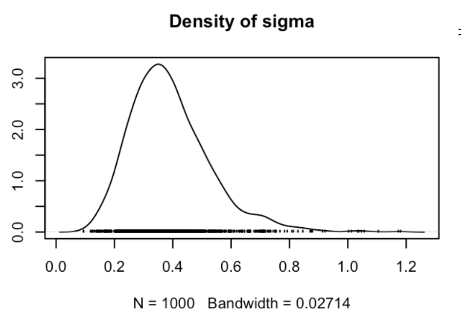

```{r setup, include=FALSE}
knitr::opts_chunk$set(
  echo = TRUE,
  message = FALSE,
  warning = FALSE,
  fig.align = 'center',
  fig.width = 8,
  fig.height = 5
)

# Chargement des bibliothèques
library(rjags)
library(coda)
library(ggplot2)
library(knitr)
```

\newpage
# Contexte de l’étude et dispositif expérimental
Dans ce rapport, nous présentons une analyse bayésienne dont le but est d’estimer le nombre de smolts de saumons atlantique (*Salmo salar*) qui migrent chaque année vers l'océan. En nous appuyant sur des données de capture-marquage-recapture collectées de 1986 à 2003, nous développons un modèle hiérarchique bayésien implémenté dans JAGS (Just Another Gibbs Sampler).

## Problématique et objectif
Le saumon atlantique présente un cycle de vie anadrome, caractérisé par une phase juvénile en eau douce suivie d'une migration vers la mer. Le passage du stade juvénile au stade smolt est une transformation physiologique appelée smoltification ou l'organisme aquiert sa tolérance à l’eau salée. Cela lui permet de migrer vers l’océan où s’effectue la majeure partie de la croissance avant que celui-ci retourne vers sa rivière d’origine pour sa reproduction.

L'objectif principal de cet étude est d'**estimer le nombre total de smolts qui migrent vers l'océan chaque année N(t)**.

## Données disponibles
Les données proviennent d’un programme de suivi des populations et nous utiliserons spécifiquement les données issues de la station de contrôle de Cerisel, un moulin situé sur l’Oir, un affluent de la Sélune. Ce site est équipé d’un dispositif de piégeage permettant de réaliser des opérations de capture-marquage-recapture (CMR) des smolts qui dévalent vers l’océan. Les données couvrent la période 1986-2003.

{ width=6cm }

Chaque année **t**, un nombre **N(t)** de smolts dévalent l'Oir. Une proportion $\theta(t)$ emprunte le bief d’amenée vers le piège et un nombre $c(t)$ de smolts sont capturés, ici $\theta(t)$ correspond donc à **l'efficacité du piège**.  Parmis les smolts capturés, $m(t)$ sont marquées à l’aide de tags et sont ensuite relâchés à environ 2 km en amont du piège. Enfin, un nombre $rm(t)$ d'entre eux sont recapturés lors de leur seconde dévalaison. Le débit de la rivière *Q(t)* est également enregistré comme covariable environnementale car cela à impact notable sur **l'efficacité du piège** $\theta(t)$.

## Avantages de l'approche bayésienne pour notre problématique

Dans le cadre de notre étude, l’utilisation d’un modèle bayésien intégré hiérarchique est particulièrement adaptée. En effet, les variables que nous cherchons à modéliser sont latentes (il n’est pas possible de compter directement l’ensemble des smolts). Nous exploitons donc les observations (c(t), m(t), rm(t) et Q(t)) pour inférer la dynamique des états cachés d’intérêts, à savoir $\theta(t)$ et in fine $N(t)$.

Les variables latentes s’insèrent dans plusieurs sous-modèles intégrés : le modèle CMR pour les captures et recaptures et le modèle d'effets aléatoires pour $\theta(t)$ avec le débit $Q(t)$ en covariable explicative. L’approche bayésienne intégrée permet une propagation naturelle de l’incertitude à travers les différentes distributions des paramètres latents.

Enfin, pour certaines années (1995 et 1996) les données de recaptures sont manquantes **rm(t)**. La dimension hiérarchique du modèle permet de partager l’information entre années, de sorte que l’estimation de la distibution des paramètres pour les années manquantes bénéficie de l’information contenue dans les années observées via les distributions a priori des paramètres latents de niveau supérieur dans la hiérarchie.

# Construction du modèle hiérarchique bayésien

Le modèle est formulé comme un modèle hiérarchique bayésien à deux niveaux. Le premier niveau décrit le processus de capture–marquage–recapture conditionnellement aux paramètres annuels latents. Le second niveau modélise la structure interannuelle de l’efficacité de capture, d’abord sans covariable, puis en introduisant l’effet du débit.

## Niveau 1 : Modèle de capture-marquage-recapture (CMR)

Le modèle CMR est formulé comme un processus génératif, décrivant la manière dont les données observées sont produites à partir de paramètres latents. Pour chaque année $t$, deux paramètres latents sont considérés :

- $N(t)$ : abondance totale inconnue de smolts migrant au cours de l’année $t$ ;
- $\theta(t)$ : efficacité de capture au piège au cours de l’année $t$, interprétée comme la probabilité qu’un individu donné soit capturé.

Nous supposons que les captures initiales $c(t)$ sont générés par une loi binomiale de paramètres : 

$$c(t) \sim \text{Binomial}(N(t), \theta(t))$$

Ce mécanisme génératif repose sur les hypothèses suivantes :

- Chaque idividus à une probabilité $\theta(t)$ d'être capturé à l'année $t$. 
- Les évènements de captures sont indépendants les uns des autres. 

Parmi les individus capturés, $m(t)$ sont marqués puis relâchés. Le nombre de recaptures observées $rm(t)$ est alors modélisé conditionnellement à $m(t)$ et $\theta(t)$ selon :

$$rm(t) \sim \text{Binomiale}(\theta(t), m(t))$$

Cette seconde étape suppose :

- Les évènements de recaptures sont également indépendants les uns des autres. 
- La probabilité de recapture est identique à la probabilité de capture initiale. Autrement dit, on fait l’hypothèse d’une absence d’effet mémoire / comportemental induit par le marquage. Sous cete hypothèse, les processus de capture et de recapture partagent un même paramètre d’efficacité $\theta(t)$.

Ainsi, les lois de probabilité associées aux processus génératifs des captures et des recaptures définissent une vraisemblance jointe, à partir de laquelle les paramètres latents $N(t)$ et $\theta(t)$ peuvent être estimés simultanément. 

## Niveau 2 : Modélisation hiérarchique de l’efficacité de capture

Les estimations directes de $\theta(t)$ obtenues à partir du seul modèle CMR présentent une variabilité interannuelle importante. Cela est liée à des différences réelles d’efficacité, mais aussi à des niveaux d’information différents selon les années voir à des données manquantes. Afin de structurer cette variabilité et de partager l’information entre années, on introduit une modélisation hiérarchique de l’efficacité de capture.

### Modélisation des effets aléatoires sur l'efficacité 

L’efficacité $\theta(t)$ étant une probabilité contrainte à l’intervalle $]0,1[$, on applique la transformation logit afin de travailler sur un espace non borné :

$$Z(t) = \text{logit}(\theta(t)) = \log\left(\frac{\theta(t)}{1 - \theta(t)}\right)$$
On suppose alors que les effets annuels transformés $Z(t)$ sont des réalisations indépendantes d’une loi normale de moyenne commune $\mu_z$ et de variance $\sigma_z^2$ tel que :

$$Z(t) \sim \mathcal{N}(\mu_{\text{z}}, \sigma^2_{\text{z}})$$
À ce stade, $\mu_z$ est constant dans le temps et représente l’efficacité moyenne du piège sur l’échelle logit, partagée par l’ensemble des années. Le paramètre $\sigma_z^2$ quantifie la variabilité interannuelle autour de cette moyenne.

Cette structure hiérarchique induit un mécanisme de **shrinkage** par lequel l’estimation de $Z(t)$ résulte d’un compromis entre l’information propre à l’année $t$ et l’information partagée entre toutes les années : les années peu informatives, ou dépourvues de données de recapture (1995 et 1996), sont ramenées vers la moyenne commune $\mu_z$, tandis que les années bien informées peuvent s’en écarter davantage. Les années avec données manquantes ne sont ainsi pas exclues de l’analyse, leur efficacité étant estimée de manière probabiliste à partir de la moyenne et de la variabilité interannuelle apprises sur l’ensemble de la série temporelle.

### Introduction de la covariable débit : 

Au-delà de cette variabilité, on s’attend à une relation décroissante entre l’efficacité du piège et le débit $Q(t)$. En effet, le débit transitant par le bief d’amenée étant supposé constant, une augmentation du débit total de la rivière entraîne une augmentation relative du débit dans le bras principal. Ce déséquilibre réduit la proportion de smolts empruntant le bief d’amenée, ce qui conduit à une diminution de l’efficacité de capture. Cela motive l’introduction du débit $Q(t)$ comme covariable explicative dans la modélisation de $\theta(t)$.

Grâce à la transformation logit, il est naturel de modéliser la moyenne de $Z(t)$ comme une fonction linéaire du débit :

$$\mu_{\text{z(t)}} =a.Q(t)+b$$

avec $a$ et $b$, les hyperparamètres (pente et ordonnée à l’origine) qui décrivent l’effet moyen du débit sur l’efficacité. La transformation logit fournit une interprétation naturelle des effets de la covariable. Un coefficient linéaire sur l’échelle logit correspond à un effet multiplicatif sur les chances de capture. Ainsi, une variation du débit $Q(t)$ induit un changement proportionnel des chances de capture, ce qui est plus réaliste que des effets additifs sur la probabilité. Enfin, $\sigma^2_{\text{z}}$ capture la variabilité interannuelle qui n’est pas expliquée par $Q(t)$

On obtient alors le modèle hiérarchique final :

$$Z(t) \sim \mathcal{N}(a.Q(t)+b, \sigma^2_{\text{z}})$$
L’efficacité de capture annuelle est enfin retrouvée par transformation inverse :
$$\theta(t) = \frac{\exp(Z(t))}{1 + \exp(Z(t))}$$


## Choix des lois a priori 

Les hyperparamètres du modèle de l’efficacité de capture sur l’échelle logit sont dotés de lois a priori faiblement informatives afin de laisser les données guider l’estimation de la relation moyenne et de l’intensité du shrinkage.

Les paramètres $a$ et $b$ suivent des lois normales centrées :

$$a \sim \mathcal{N}(0, 0.01)$$
$$b \sim \mathcal{N}(0, 0.01)$$
L’écart-type $\sigma_z$, contraint à être positif, suit une loi uniforme :

$$\sigma_z \sim \mathcal{Uniforme}(0, 10)$$

L’abondance annuelle $N(t)$ est un paramètre latent discret. En l’absence d’information précise sur son ordre de grandeur, une loi uniforme peu informative est également choisie sur un intervalle biologiquement plausible et compatible avec les observations :

$$N(t) \sim \mathcal{Uniforme}(c(t), 50000)$$
Chaque valeur tirée est ensuite arrondie à l’entier le plus proche pour respecter la nature discrète de la population.

L’estimation conjointe des paramètres annuels et des hyperparamètres est réalisée par échantillonnage MCMC, en utilisant trois chaînes indépendantes pour vérifier la convergence et explorer correctement l’espace des paramètres.

# Résultats 


## Diagnostic de convergence

## 3.1 Diagnostic de convergence

L’objectif est de s’assurer que l’échantillonnage MCMC est fiable et que les chaînes ont bien convergé vers une distribution de probabilité stable. Le diagnostic se fait d’abord par une analyse visuelle des traceplots des chaînes MCMC, complétée par le test de Gelman-Rubin ($\hat{R}$) pour quantifier la stabilité et l’indépendance des chaînes.

### 3.1.1 Convergence des hyperparamètres

Nous commençons par l’évaluation de la convergence des hyperparamètres $a$, $b$ et $\sigma$.

{ width=80% }

```{r, echo=FALSE}
diag_hyper <- data.frame(
  Paramètre = c("a", "b", "sigma", "Multivarié"),
  PSRF = c(1.01, 1.01, 1.01, 1.02),
  PSRF_95_CI_sup = c(1.05, 1.04, 1.02, "--"),
  Interprétation = c(
  "Convergence satisfaisante",
  "Convergence satisfaisante",
  "Convergence satisfaisante",
  "Convergence globale"
  )
)

kable(
diag_hyper,
caption = "Diagnostic de convergence des hyperparamètres (PSRF de Gelman-Rubin).",
align = "lccc"
)
```


Les PSRF proches de 1 pour chacun des hyperparamètres indiquent une convergence satisfaisante, et les traceplots confirment l’absence de convergence vers des distributions de probabilités multi-modales. Le PSRF multivarié à 1.02 valide également la convergence globale de ces paramètres.


### 3.1.2 Convergence des paramètres latents

Nous examinons ensuite la convergence des paramètres latents $\theta(t)$ et $N(t)$. Les traceplots ci-dessous présentent des années représentatives (1, 12 et 18).


```{r, echo=FALSE}
library(knitr)
diag_conv <- data.frame(
Paramètre = c(
  "θ[1]", "θ[12]", "θ[18]", "Multivariate PSRF",
  "N[1]", "N[12]", "N[18]", "Multivariate PSRF"
  ),
  PSRF_point = c(1.00, 1.00, 1.00, 1.02, 1.00, 1.01, 1.00, 1.03),
  PSRF_upper_95 = c(1.00, 1.02, 1.00, "--", 1.00, 1.02, 1.00, "--"),
  Interprétation = c(
  "Convergence satisfaisante", "Convergence satisfaisante", "Convergence satisfaisante",
  "Convergence globale sur 18 années",
  "Convergence satisfaisante", "Convergence satisfaisante", "Convergence satisfaisante",
  "Convergence globale sur 18 années"
  )
)

kable(
diag_conv,
caption = "Extrait des diagnostics de convergence pour θ(t) et N(t). La convergence globale a été évaluée sur les 18 années.",
align = "lccc"
)

```

Ces diagnostics montrent que $\theta(t)$ et $N(t)$ ont également convergé de manière satisfaisante. Les PSRF multivariés confirment la convergence globale des paramètres sur l’ensemble des 18 années.


## Analyse des hyperparamètres et interprétation

L’objectif de cette section est de confirmer les hypothèses du modèle hiérarchique et de mettre en évidence l’effet du shrinkage sur les paramètres latents $\theta(t)$.

### Hyperparamètres a et b :

Les densités postérieures des hyperparamètres $a$ et $b$ sont présentées ci dessous.

{ width=80% }

La densité postérieure de $a$ est fortement négative et centrée autour de $\approx -0.3$, indiquant que la pente de la régression logit($\theta_t$) ∼ $Q(t)$ est négative. Autrement dit, une augmentation du débit $Q(t)$ entraîne une diminution de l’efficacité du piège $\theta(t)$. Ce résultat est cohérent avec le mécanisme attendu : lorsque le débit total de la rivière augmente, le débit relatif dans le bief d’amenée reste constant, ce qui réduit la proportion de smolts empruntant ce bras et conduit à une baisse de l’efficacité de capture.

La figure suivante illustre cette relation de décroissante en présentant les moyennes postérieures de $\theta(t)$ et de $\text{logit}(\theta(t))$ en fonction du débit $Q(t)$ pour les 18 années de suivi.

{ width=60% }

Sur l’échelle logit, la relation apparaît globalement linéaire, ce qui valide visuellement l’hypothèse d’un modèle linéaire $logit(\theta(t)) \sim Q(t)$. Les années pour lesquelles les données de recaptures sont manquantes suivent également la tendance générale, illustrant que le modèle hiérarchique permet de partager l’information.

### Variabilité résiduelle interannuelle et part de variance expliquée

La figure suivante montre la densité postérieure de $\sigma^2_{\text{z}}$ qui reflète la variabilité résiduelle de $\text{logit}(\theta(t))$ qui n’est pas expliquée par le débit $Q(t)$.

{ width=40% }

La simple valeur de $\sigma^2_{\text{z}}$ n’est pas directement interprétable comme la proportion de variance expliquée de $\theta(t)$. Pour quantifier l’importance relative de l’effet du débit et de la variabilité résiduelle, on calcule l’analogue d’un $R^2$ sur l’échelle logit :
$$
R^2_{\text{logit}} = \frac{\mathrm{Var}(\hat{\text{logit}}(\theta_t))}{\mathrm{Var}(\hat{\text{logit}}(\theta_t)) + \sigma^2_{\text{z}}}, \quad \text{où} \quad \hat{\text{logit}}(\theta_t) = a + b Q_{\text{scaled}}.
$$
Le tableau suivant résume les quantiles de la variance résiduelle $\sigma^2_{\text{z}}$ et de la part de variance expliquée $R^2_{\text{logit}}$, permettant de visualiser à la fois l’incertitude sur $\sigma^2_{\text{z}}$ et la performance explicative du modèle :

```{r, echo=FALSE}
library(knitr)

# Exemple de tableau
tab <- data.frame(
  Statistique = c("sigma²_z", "R²_logit"),
  `5%` = c(0.205, 0.922),
  `25%` = c(0.294, 0.962),
  Médiane = c(0.371, 0.976),
  `75%` = c(0.464, 0.985),
  `95%` = c(0.650, 0.992)
)

kable(tab, caption = "Résumé de la variance résiduelle σ²_z et de la part de variance expliquée R²_logit")
```


Ces résultats montrent que la variabilité résiduelle interannuelle $\sigma^2_{\text{z}}$ est modérée, indiquant qu’une partie de la variabilité de $\theta(t)$ n’est pas expliquée par le débit $Q(t)$.

En revanche, les valeurs élevées de $R^2_{\text{logit}}$ montrent que la relation linéaire entre $\text{logit}(\theta(t))$ et le débit $Q(t)$ explique l’essentiel de la variabilité interannuelle sur l’échelle du modèle, confirmant le rôle structurant du débit et justifiant l’utilisation de la régression hiérarchique pour affiner le prior de $\theta(t)$.


### Illustration du shrinkage hiérarchique 

La figure suivante présente les distributions postérieures de $\theta(t)$ par année.

{ width=80% }


Les distributions de $\theta(t)$ sont relativement bien définies, bénéficiant à la fois des données CMR disponibles et du partage d’information hiérarchique. Pour les années sans données de recaptures, le shrinkage ramène $\theta(t)$ vers la moyenne globale $\mu_z$, tout en tenant compte du débit spécifique de ces années et de son effet sur $\theta(t)$ précédemment discuté. Cette illustration met en évidence l’intérêt du modèle hiérarchique pour traiter les valeurs manquantes.

## Estimation de N(t) et interprétation

### Loi jointe de l'efficacité et de l'abondance 

La figure suivante présente la loi jointe de $(\theta(1), N(1))$ pour l'année 1. 

{ width=40% }

On observe une corrélation négative entre l’efficacité du piège $\theta_i$ et l’abondance $N_i$. Cela est conforme est conforme aux propriétés des modèles de Capture–Marquage–Recapture : pour un nombre de captures observées donné, une faible efficacité de capture implique nécessairement une abondance plus élevée, et réciproquement.

Cette figure illustre clairement la propagation explicite de l’incertitude entre ces deux paramètres. l’étalement conjoint de la distribution montre que l’incertitude sur l’efficacité de capture $\theta(1)$ se répercute directement sur l’estimation de l’abondance $N(1)$. Le modèle fournit ainsi une distribution a posteriori réaliste de $N(1)$. À l’inverse, une approche fréquentiste fondée sur une valeur prédite et fixée de $\theta(1)$ conduirait à une sous-estimation énorme de l’incertitude réelle associée à l’abondance.

### Abondance annuelle $N(t)$

Enfin, les estimations du nombre $N(t)$ de smolts migrants vers l'océan chaques années sont présentés sur la figure suivante (avec intervalles de confiances à 95%). 


{ width=80% }

On observe une forte variabilité interannuelle de l’abondance des smolts, avec des valeurs allant de quelques centaines à plus de 2500 individus selon les années. Pour les années 10 et 11 (1995 et 1996), pour lesquelles les données de recapture sont manquantes, les estimations restent néanmoins bien définies, avec des distributions relativement étroites pour $N(t)$. Cette précision résulte directement de l’intégration hiérarchique du modèle.

En effet, les estimations de l’efficacité de capture $\theta(t)$ pour ces années bénéficient de l’effet de shrinkage induit par la structure hiérarchique et par l’inclusion du débit $Q(t)$ comme covariable explicative. Les valeurs de $\theta(t)$ sont ainsi informées par l’ensemble des années **data-rich** observées et par la relation structurelle entre $\theta(t)$ et le débit. Cette meilleure précision sur $\theta(t)$ se propage mécaniquement aux estimations de l’abondance $N(t)$, via la relation de capture propre aux modèles CMR. 

Ces résultats mettent en évidence l’intérêt du modèle hiérarchique intégré : il stabilise l’estimation des paramètres latents, assure une propagation cohérente de l’incertitude et améliore la robustesse des prédictions, même pour les années avec des données manquantes.


